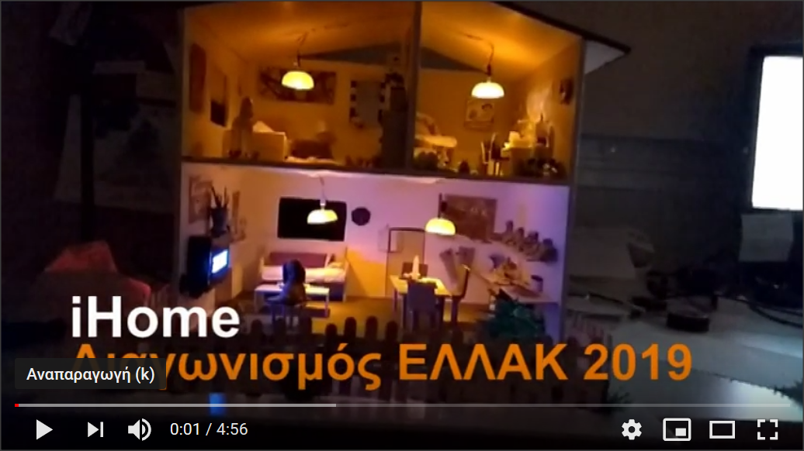

# iHome
Συμμετοχή στο διαγωνισμό ρομποτικής της ellak σχολικού έτους 2018 - 19

**Γεωργία Λέων**  
2ο Γυμνάσιο Ναυπλίου

- [Τί είναι το Έξυπνο σπίτι](smarthome.md)
- [Εξαρτήματα - Τιμές](Εξαρτήματα/README.md)
- [Η Κατασκευή](Κατασκευή/README.md)
- [Ο Προγραμματισμός](Προγραμματισμός/README.md)

