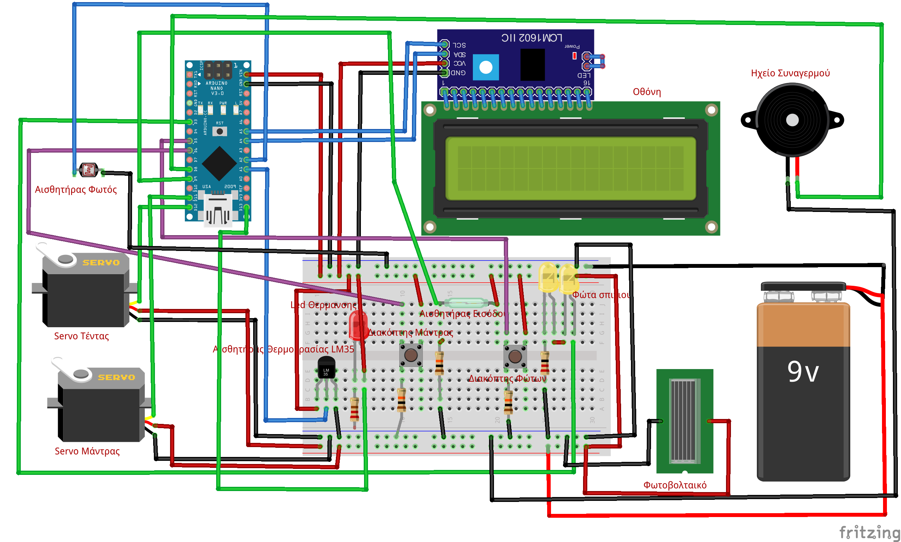
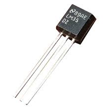
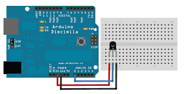
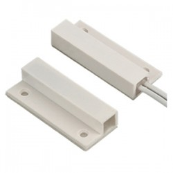
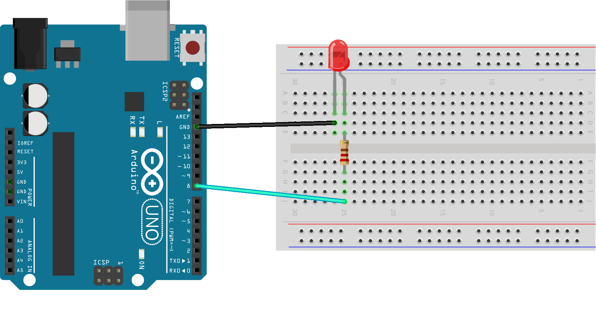
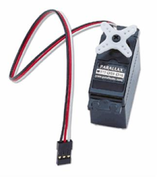
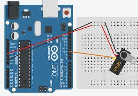

# Τα εξαρτήματα που χρησιμοποιήθηκαν και η χρήση τους

## Εξαρτήματα - Τιμές
A/A   | Περιγραφή   | Ποσότητα  | Τιμή / Τεμ. € | Σύνολο €
------| ------------|-----------|---------------|----------
1 | [LM35DZ LM35 TO-92 NSC TEMPERATURE SENSOR IC](https://www.ebay.com/itm/1PCS-LM35DZ-LM35-TO-92-NSC-TEMPERATURE-SENSOR-IC-Inductor-NEW/232397948189?hash=item361bff451d:g:mXMAAOSw9~5ZXKYy&frcectupt=true) | 1 | 0.84 | 0.84
2 | [Αισθητήρας φωτός](https://www.ebay.com/itm/1-2-5-10-PCS-LM393-Optical-Photosensitive-Light-Sensor-Module-Arduino-Shield/302095762590?var=600908415798&hash=item46564f849e:m:mH6unlDwpaOI-wAI9798eVQ&frcectupt=true) | 1 | 0.65 | 0.65
3 | Αισθητήρας πόρτας (μαγνητική επαφή διακόπτης)| 1 | 1 | 1
4 | [Led για τα φώτα λευκά ή κίτρινα](https://grobotronics.com/led-diffused-5mm-white.html) | 4 | 0.2 | 0.8
5 | [Led για τα καλοριφέρ](https://grobotronics.com/led-diffused-5mm-elrd.html)  | 1 | 0.1 | 0.1
6 | [Κινητήρας σέρβο για την τέντα](https://grobotronics.com/servo-micro-1.5kg.cm-plastic-gears-feetech-fs90.html) | 1 | 4.90 | 4.90
7 | [Κινητήρας σέρβο για την μάντρα](https://grobotronics.com/servo-micro-1.5kg.cm-plastic-gears-feetech-fs90.html) | 1 | 4.90 | 4.90
8 | [Solar Panel 2W 136x110mm](https://grobotronics.com/solar-panel-2w-136x110mm.html)  | 2  |  5.90 |  11.80  |        
9 | [Ηχείο buzzer](https://grobotronics.com/buzzer-2-5v-30ma.html) | 1 | 0.65 | 0.65
10| [I2C 1602 Blue Backlight LCD Display Screen Module For Arduino](https://www.ebay.com/itm/IIC-I2C-1602-Blue-Backlight-LCD-Display-Module-For-Arduino/382822425595?epid=19030007170&hash=item5921fea3fb:g:YgYAAOSw619cflnM&frcectupt=true)  | 1  | 3 | 3.53
11| [Arduino Nano compatible](https://grobotronics.com/nano-ft232-atmega328p-compatible-for-arduino-nano.html) | 1  | 9  |  9
12  | [Project Box 135x135x60mm](https://grobotronics.com/project-box-135x135x60mm-grey.html)   | 1   | 6.4  |  6.4
13| Αντιστάσεις 1/4 W 220 Ω και 10ΚΩ  | 10  | 0.01  |  0.1
14| Κόντρα Πλακέ πάχους 6mm  |   |   | 7  
15| Ξύλο Μπάλσα  |   |   | 4
16| Μακετόχαρτο  | 1  |   | 1
17| Ξυλάκια Παγωτού για φράχτη | 1 πακ.  | 1.5  |  1.5
18| Διάφορα μικρα υλικά από παιχνίδια κλπ  |   |   |  
  | Σύνολο  | | |

### Αισθητήρας θερμοκρασίας LM35
- Λειτουργεί με τάση εισόδου από 4 έως 30 Volt
- Μετράει θερμοκρασίες από -55 έως 150ο C
- Κοιτάζοντας την μπροστινή πλευρά του LM35 (επίπεδη πλευρά), ο αριστερός ακροδέκτης είναι ο ακροδέκτης της τροφοδοσίας και ο δεξιός ακροδέκτης είναι ο ακροδέκτης της γείωσης. Ο μεσαίος συνδέεται με  ένα από τα pin αναλογικής εισόδου.
- Για κάθε έναν oC αντιστοιχούν 10 mV.

  

### Αισθητήρας φωτός

### Αισθητήρας πόρτας μαγνητικής επαφής
Η λειτουργία των αισθητήρων μαγνητικής επαφής βασίζεται σε ένα αισθητήρα και ένα μαγνήτη. Ο αισθητήρας τοποθετείται στο κάσωµα της πόρτας ή του παραθύρου, ενώ η μαγνητική επαφή τοποθετείται πάνω στην πόρτα ή πάνω στο παράθυρο . Αυτό δημιουργεί ένα κύκλωμα το οποίο, όταν παραβιαστεί( με το άνοιγμα μιας πόρτας η ενός παραθύρου, τότε στέλνει σήμα στη κεντρική μονάδα συναγερμού, η οποία και αντιλαμβάνεται τη παραβίαση της εκάστοτε ζώνης και ενεργοποιεί το συναγερμό.

### Led φώτα
Μια δίοδος εκπομπής φωτός (light emitting diode,LED) είναι στην ουσία μια ένωση pn που έχει κατασκευαστεί από ένα ημιαγωγό άμεσου ενεργειακού χάσματος και στην οποία η επανασύνδεση των ζευγών ηλεκτρονίων έχει ως αποτέλεσμα την εκπομπή φωτονίων.

### Κινητήρας σέρβο

Οι κινητήρες servo είναι μικρές συσκευές που έχουν έναν εξωτερικό άξονα. Αυτός ο άξονας μπορεί να μετακινηθεί σε διάφορες θέσεις αν αποσταλεί στον servo ένα κωδικοποιημένο σήμα. Όσο υπάρχει αυτό το σήμα στην γραμμή εισόδου του Servo τόσο αυτός θα διατηρεί τον άξονα του σε μια συγκεκριμένη θέση. Όταν αλλάζει το σήμα προκαλεί στον servο να μεταβάλει την γωνία του άξονα. Η τάση που απαιτεί για την λειτουργία του είναι 6 Volt DC. Ο άξονας του έχει μπορεί να μετακινηθεί από την θέση 0ο στη θέση 180ο σε 1.5 second. Αυτό ορίζεται και ως η ταχύτητα του κινητήρα. Ζυγίζει περίπου 45gr και έχει ροπή στρέψης 3.40 kg-cm.

### Φωτοβολταϊκά
Τα φωτοβολταϊκά ανήκουν στη κατηγορία των Ανανεώσιμων Πηγών Ενέργειας. Η λειτουργία του φωτοβολταϊκού συστήματος στηρίζετε στις βασικές ιδιότητες των ημιαγωγών υλικών σε ατομικό επίπεδο. Όταν το φως προσπίπτει σε μια επιφάνεια είτε ανακλάται, είτε την διαπερνά (διαπερατότητα) είτε απορροφάται από το υλικό της επιφάνειας. Η απορρόφηση του φωτός ουσιαστικά σημαίνει την μετατροπή του σε μια άλλη μορφή ενέργειας η οποία συνήθως είναι η θερμότητα.
Παρόλα αυτά όμως υπάρχουν κάποια υλικά τα οποία έχουν την ιδιότητα να μετατρέπουν την ενέργεια των προσπιπτοντων φωτονίων σε ηλεκτρική ενέργεια. Αυτά τα υλικά είναι οι ημιαγωγοί.

### Ηχείο

[Αρχική Σελίδα έργου](https://github.com/legeonaf/robotics.ellak)
