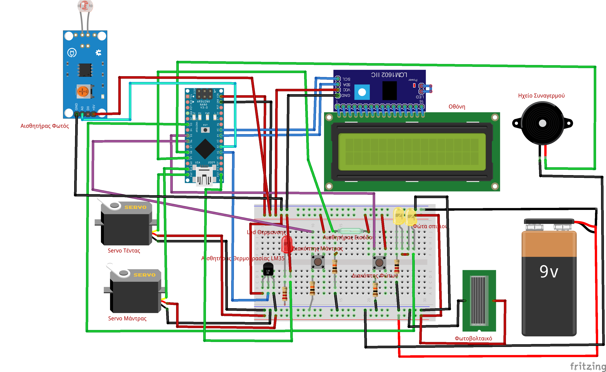
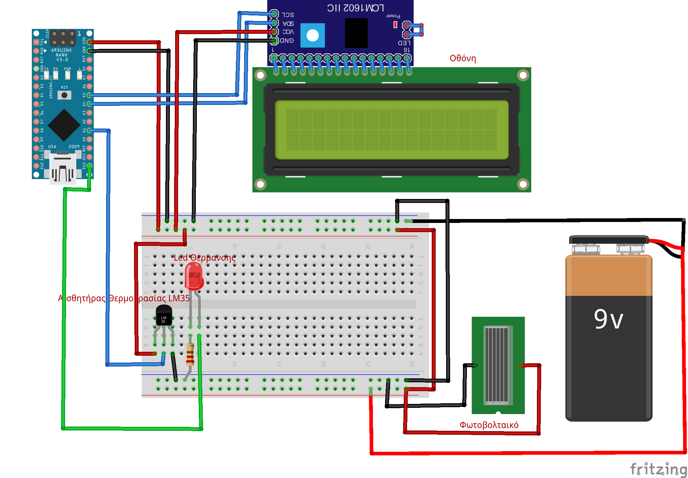
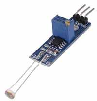
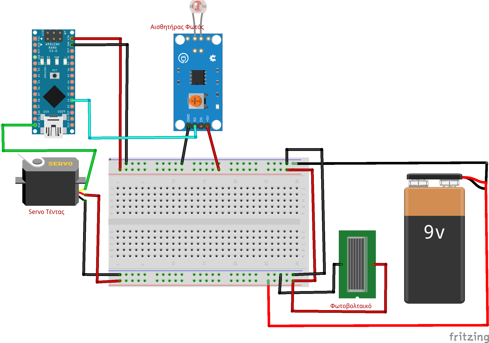
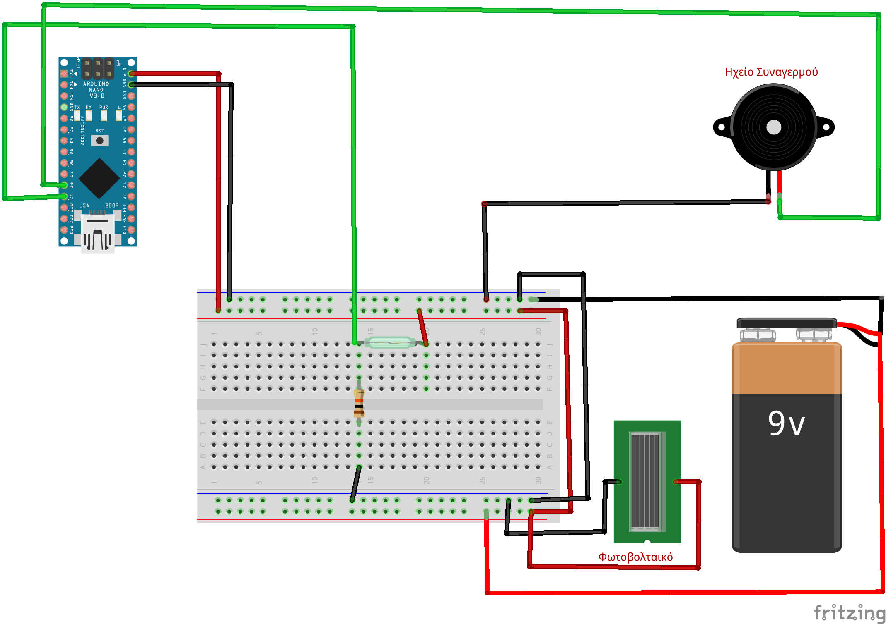
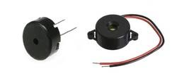
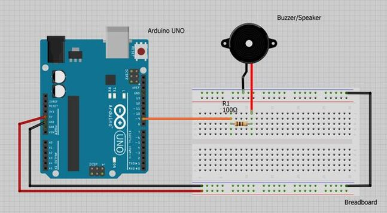
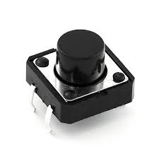

# Τα εξαρτήματα που χρησιμοποιήθηκαν και η χρήση τους

## Εξαρτήματα - Τιμές
A/A   | Περιγραφή   | Ποσότητα  | Τιμή / Τεμ. € | Σύνολο €
------| ------------|-----------|---------------|----------
1 | [LM35DZ LM35 TO-92 NSC TEMPERATURE SENSOR IC](https://www.ebay.com/itm/1PCS-LM35DZ-LM35-TO-92-NSC-TEMPERATURE-SENSOR-IC-Inductor-NEW/232397948189?hash=item361bff451d:g:mXMAAOSw9~5ZXKYy&frcectupt=true) | 1 | 0.84 | 0.84
2 | [Αισθητήρας φωτός](https://www.ebay.com/itm/1-2-5-10-PCS-LM393-Optical-Photosensitive-Light-Sensor-Module-Arduino-Shield/302095762590?var=600908415798&hash=item46564f849e:m:mH6unlDwpaOI-wAI9798eVQ&frcectupt=true) | 1 | 0.65 | 0.65
3 | Αισθητήρας πόρτας (μαγνητική επαφή διακόπτης)| 1 | 1 | 1
4 | [Led για τα φώτα λευκά ή κίτρινα](https://grobotronics.com/led-diffused-5mm-white.html) | 4 | 0.2 | 0.8
5 | [Led για τα καλοριφέρ](https://grobotronics.com/led-diffused-5mm-elrd.html)  | 1 | 0.1 | 0.1
6 | [Κινητήρας σέρβο για την τέντα](https://grobotronics.com/servo-micro-1.5kg.cm-plastic-gears-feetech-fs90.html) | 1 | 4.90 | 4.90
7 | [Κινητήρας σέρβο για την μάντρα](https://grobotronics.com/servo-micro-1.5kg.cm-plastic-gears-feetech-fs90.html) | 1 | 4.90 | 4.90
8 | [Solar Panel 2W 136x110mm](https://grobotronics.com/solar-panel-2w-136x110mm.html)  | 2  |  5.90 |  11.80  |        
9 | [Ηχείο buzzer](https://grobotronics.com/buzzer-2-5v-30ma.html) | 1 | 0.65 | 0.65
10| [I2C 1602 Blue Backlight LCD Display Screen Module For Arduino](https://www.ebay.com/itm/IIC-I2C-1602-Blue-Backlight-LCD-Display-Module-For-Arduino/382822425595?epid=19030007170&hash=item5921fea3fb:g:YgYAAOSw619cflnM&frcectupt=true)  | 1  | 3 | 3.53
11| [Arduino Nano compatible](https://grobotronics.com/nano-ft232-atmega328p-compatible-for-arduino-nano.html) | 1  | 9  |  9
12  | [Project Box 135x135x60mm](https://grobotronics.com/project-box-135x135x60mm-grey.html)   | 1   | 6.4  |  6.4
13| Αντιστάσεις 1/4 W 220 Ω και 10ΚΩ  | 10  | 0.01  |  0.1
14| Κόντρα Πλακέ πάχους 6mm  |   |   | 7  
15| Ξύλο Μπάλσα  |   |   | 4
16| Μακετόχαρτο  | 1  |   | 1
17| Ξυλάκια Παγωτού για φράχτη | 1 πακ.  | 1.5  |  1.5
18| Διάφορα μικρα υλικά από παιχνίδια κλπ  |   |   |  
  | **Σύνολο**  | | | | 58

Το ολοκληρωμένο κύκλωμα του σπιτιού

### Αισθητήρας θερμοκρασίας LM35 Έλεγχος Θερμοκρασίας

- Λειτουργεί με τάση εισόδου από 4 έως 30 Volt
- Μετράει θερμοκρασίες από -55 έως 150ο C
- Κοιτάζοντας την μπροστινή πλευρά του LM35 (επίπεδη πλευρά), ο αριστερός ακροδέκτης είναι ο ακροδέκτης της τροφοδοσίας και ο δεξιός ακροδέκτης είναι ο ακροδέκτης της γείωσης. Ο μεσαίος συνδέεται με  ένα από τα pin αναλογικής εισόδου.
- Για κάθε έναν oC αντιστοιχούν 10 mV.

Σύνδεση με το Arduino

### Αισθητήρας φωτός και η Τέντα

Σύνδεση με το Arduino

Η φωτοαντίσταση είναι μια μεταβλητή αντίσταση η τιμή της οποίας αλλάζει ανάλογα με το φως που πέφτει πάνω σε αυτή. Τη φωτοαντίσταση τη συναντάμε σε κυκλώματα τα οποία θέλουν με κάποιο τρόπο να αναγνωρίσουν αν το περιβάλλον είναι φωτεινό ή σκοτεινό.

### Mαγνητική επαφή

Σύνδεση με το Arduino

Η λειτουργία των αισθητήρων μαγνητικής επαφής βασίζεται σε ένα αισθητήρα και ένα μαγνήτη. Ο αισθητήρας τοποθετείται στο κάσωµα της πόρτας ή του παραθύρου, ενώ η μαγνητική επαφή τοποθετείται πάνω στην πόρτα ή πάνω στο παράθυρο . Αυτό δημιουργεί ένα κύκλωμα το οποίο, όταν παραβιαστεί( με το άνοιγμα μιας πόρτας η ενός παραθύρου, τότε στέλνει σήμα στη κεντρική μονάδα συναγερμού, η οποία και αντιλαμβάνεται τη παραβίαση της εκάστοτε ζώνης και ενεργοποιεί το συναγερμό.

### Led φώτα

Μια δίοδος εκπομπής φωτός (light emitting diode,LED) είναι στην ουσία μια ένωση pn που έχει κατασκευαστεί από ένα ημιαγωγό άμεσου ενεργειακού χάσματος και στην οποία η επανασύνδεση των ζευγών ηλεκτρονίων έχει ως αποτέλεσμα την εκπομπή φωτονίων.

Σύνδεση με το Arduino

### Κινητήρας σέρβο

Οι κινητήρες servo είναι μικρές συσκευές που έχουν έναν εξωτερικό άξονα. Αυτός ο άξονας μπορεί να μετακινηθεί σε διάφορες θέσεις αν αποσταλεί στον servo ένα κωδικοποιημένο σήμα. Όσο υπάρχει αυτό το σήμα στην γραμμή εισόδου του Servo τόσο αυτός θα διατηρεί τον άξονα του σε μια συγκεκριμένη θέση. Όταν αλλάζει το σήμα προκαλεί στον servο να μεταβάλει την γωνία του άξονα. Η τάση που απαιτεί για την λειτουργία του είναι 6 Volt DC. Ο άξονας του έχει μπορεί να μετακινηθεί από την θέση 0ο στη θέση 180ο σε 1.5 second. Αυτό ορίζεται και ως η ταχύτητα του κινητήρα. Ζυγίζει περίπου 45gr και έχει ροπή στρέψης 3.40 kg-cm.

### Φωτοβολταϊκά

Τα φωτοβολταϊκά ανήκουν στη κατηγορία των Ανανεώσιμων Πηγών Ενέργειας. Η λειτουργία του φωτοβολταϊκού συστήματος στηρίζετε στις βασικές ιδιότητες των ημιαγωγών υλικών σε ατομικό επίπεδο. Όταν το φως προσπίπτει σε μια επιφάνεια είτε ανακλάται, είτε την διαπερνά (διαπερατότητα) είτε απορροφάται από το υλικό της επιφάνειας. Η απορρόφηση του φωτός ουσιαστικά σημαίνει την μετατροπή του σε μια άλλη μορφή ενέργειας η οποία συνήθως είναι η θερμότητα.
Παρόλα αυτά όμως υπάρχουν κάποια υλικά τα οποία έχουν την ιδιότητα να μετατρέπουν την ενέργεια των προσπιπτοντων φωτονίων σε ηλεκτρική ενέργεια. Αυτά τα υλικά είναι οι ημιαγωγοί.

### Ηχείο Buzzer

Σύνδεση με το Arduino

Το ηχείο Buzzer είναι παθητικό επειδή δεν διαθέτει κανένα σύστημα ώστε να παράγει ήχο ή ηχώ από μόνο του. Είναι απαραίτητο για το Buzzer ένας μικροελεγκτής, όπως ένα Arduino για να παράγει ήχο. Επειδή η συσκευή είναι παθητική, λειτουργεί περισσότερο σαν ένα μικρό ηχείο παρά ένα βομβητή.  Τέτοια ηχεία συναντάμε σε υπολογιστές, ξυπνητήρια, σε συστήματα συναγερμού ακόμα και στα πληκτρολόγια των ATMs.

### Διακόπτης

Οι διακόπτες έχουν σημεία με τα οποία συνδέονται με το κύκλωμα τα οποία ονομάζονται ακροδέκτες. Κάθε διακόπτης έχει δύο καταστάσεις, την κατάσταση που είναι κλειστός και την κατάσταση που είναι ανοιχτός. Όταν ένας διακόπτης είναι ανοιχτός δεν επιτρέπει τη διέλευση ηλεκτρικού ρεύματος μεταξύ των ακροδεκτών του, ενώ όταν είναι κλειστός επιτρέπει τη διέλευση ηλεκτρικού ρεύματος μεταξύ των ακροδεκτών του.

### Οθόνη LCD

 Το βασικό δομικό στοιχείο μιας οθόνης υγρών κρυστάλλων είναι ο υγρός κρύσταλλος. Υπάρχουν κάποια υλικά στη φύση τα οποία βρίσκονται σε μια ενδιάμεση κατάσταση, δηλαδή δεν μπορούν να θεωρηθούν ούτε υγρά αλλά ούτε στερεά. Από τη μια τα μόριά τους μπορούν να κινηθούν ελεύθερα όπως τα υγρά, ενώ από την άλλη ο προσανατολισμός τους παραμένει ο ίδιος, όπως τα στερεά. Λόγω της μοριακής τους δομής, οι υγροί κρύσταλλοι έχουν την ιδιότητα να αλλάζουν την πολικότητα του φωτός που περνά από μέσα τους, ανάλογα με την τάση του ηλεκτρικού ρεύματος που εφαρμόζεται σε αυτούς. Συνεπώς, εσωκλείοντας ένα στρώμα υγρών κρυστάλλων μεταξύ δύο φίλτρων οριζόντιας πόλωσης του φωτός, τα οποία είναι προσανατολισμένα ώστε να μην αφήνουν τη διέλευση του, είναι εφικτό να ελεγχθεί η ποσότητα του φωτός που θα περάσει τη διάταξη αυτή ανάλογα με την ηλεκτρική τάση που εφαρμόζεται στο στρώμα των υγρών κρυστάλλων. Επειδή όμως οι υγροί κρύσταλλοι δεν εκπέμπουν φως, οι οθόνες υγρών κρυστάλλων φωτίζονται από κάποια εξωτερική πηγή φωτός, η οποία στην περίπτωση των οθονών υγρών κρυστάλλων που χρησιμοποιούνται στους Η/Υ,είναι μια μικρή λάμπα φθορίου πίσω από τα στρώματα. Η εικόνα σχηματίζεται ανάλογα με το ηλεκτρικό φορτίο που ασκείται στους υγρούς κρυστάλλους, είτε από ένα πλέγμα μικροσκοπικών ηλεκτροδίων στις οθόνες τύπου LCD.

[Αρχική Σελίδα έργου](https://github.com/legeonaf/robotics.ellak)
