# Η κατασκευή

## Συλλογή υλικών

### Για την κατασκευή του σκελετού του σπιτιού μας θα χρειαστούμε:

Υλικά:
- Ξυλεία κόντρα πλακέ πάχους 0,5cm
- Ξυλόκολλα
- Ράβδοι κόλλας σιλικόνης, 4-5 ράβδοι
- Χρώματα και βερνίκια ξύλου της επιλογής μας
- Καρφιά και βίδες
- Στόκος ξύλου
- Μικροί μεντεσέδες, 2
- Καλώδια
- Μακετόχαρτο, 45cm*45cm
- Ξυλάκια παγωτού
- Ύφασμα
 
Για προαιρετικές διακοσμήσεις για το σπίτι και τον κήπο:
- Ξύλα Balsa,ύφασμα, χαρτί, βίδες (για έπιπλα)
- Πράσινο χαρτί γκοφρέ (για γρασίδι)
- Ακρυλικά χρώματα (για το μονοπάτι του κήπου)
- Έτοιμες φιγούρες, φυτά και μινιατούρες επίπλων/πραγμάτων
- Χάρτινα ποτήρια με σχέδια (για πίνακες)

Εργαλεία:
- Χάρακας
- Μέτρο
- Γυαλόχαρτα
- Σφυρί
- Τρυπανάκι
- Kατσαβίδι
- Μολύβι
- Πριόνι
- Χαρτοταινία
- Πιστόλι σιλικόνης

## Επεξεργασία ξυλείας

### Κοπή ξύλων
Μετράμε, σχεδιάζουμε και κόβουμε με το πριόνι στα ξύλα κόντρα πλακέ οκτώ παραλληλόγραμμα
(Π):
- Π1 (πάτωμα κάτω) 35cm*25cm
- Π2 (πάτωμα πάνω) 35cm*25cm
- Π3 (τοίχος δεξιά) 30cm*25cm
- Π4 (τοίχος αριστερά) 30cm*25cm
- Π5 (τοίχος μέση) 17cm*26cm
- Π6 (σκεπή δεξιά) 20,5cm*25cm
- Π7 (σκεπή αριστερά) 26cm*25cm
- Π8 (τοίχος πίσω) 36cm*31cm

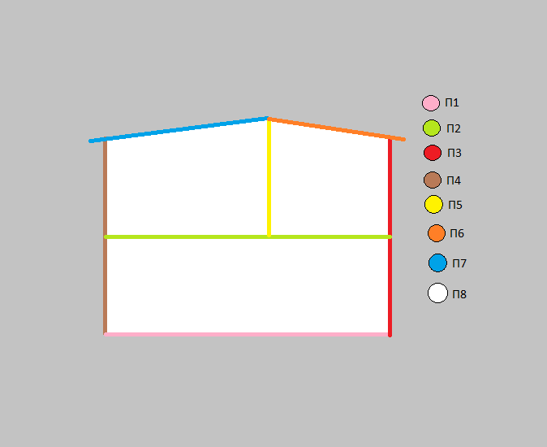

### Κοπή παραθύρων
Για τα δύο πλαίνα παράθυρα παίρνουμε τα Π3 και Π4 και κόβουμε δύο παραλληλόγραμμες τρύπες για παράθυρα διαστάσεων
8cm(πλάτος)x6cm(ύψος) σε ύψος 21cm και με απόσταση απο τα άκρα 8cm απο την αριστερή άκρη του ξύλου και 9cm απο την δεξιά.
Για το πίσω παράθυρο παίρνουμε το Π8 και κόβουμε ένα παραλληλόγραμμο παράθυρο διαστάσεων 9cm(πλάτος)x5cm(ύψος) σε ύψος 8cm και με απόσταση απο τα άκρα 5,5cm απο την αριστερή άκρη και 21,5cm απο την δεξιά. Για την πόρτα παίρνουμε το ίδιο ξύλο και κάνουμε μια παραλληλόγραμμη τρύπα διαστάσεων 10cm(ύψος)x5cm(πλάτος) με απόσταση απο τα άκρα 20cm απο  την αριστερή άκρη και 11cm απο την δεξιά.

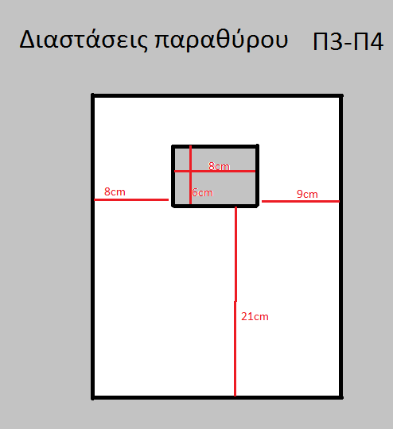

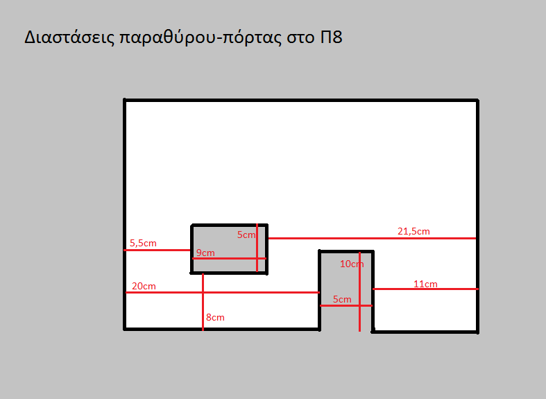

### Στοκάρισμα παραθύρων και πόρτας
Για το στοκάρισμα χρησιμοποιούμε τον στόκο ξύλου και αλείφουμε τις εσωτερικές άκρες των παραθύρων και της πόρτας(κυρίως στος γωνίες) οσο χρειάζεται μεχρι να καλυφθούν τυχών εσοχές και γρατζουνιές που προκλήθηκαν κατα την κοπή. Αφόυ στεγνώσουν τρίβουμε όλα τα ξύλα με το γυαλόχαρτο στις άκρες και στην επιφάνεια καθώς και εκεί που στοκάραμε.

           

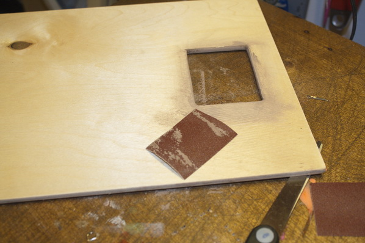

### Συναρμολόγηση κομματιών
Για την συναρμολόγηση τρυπάμε τα ξύλα με το τρυπανάκι εκεί που θα βάλουμε τα καρφιά, τα κολλάμε και τα καρφώνουμε σύμφωνα με το σχήμα.

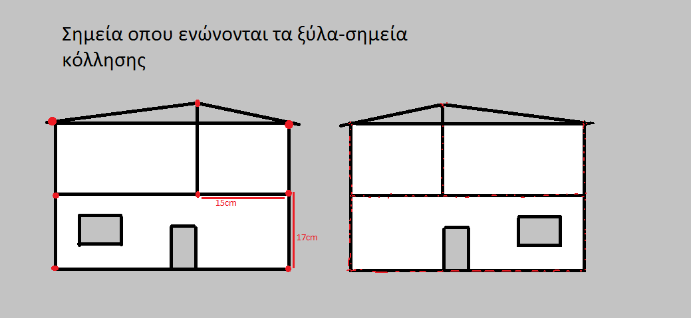

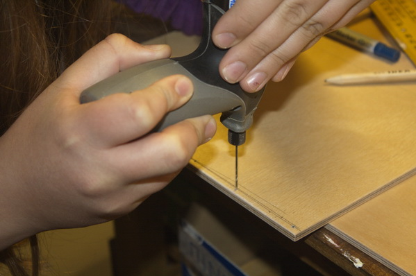

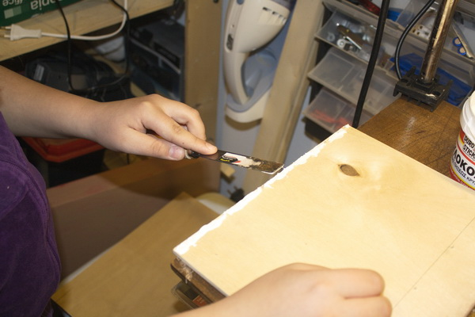

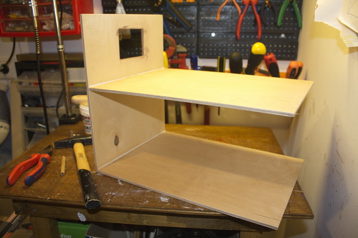

### Βάψιμο
Σε αυτό το στάδιο βερνικώνουμε τα πατώματα και αφού στεγνώσουν βάφουμε τους εξωτερικούς και τους εσωτερικούς τοίχους του σπιτιού με χρώματα της επιλογής μας. Χρησιμοποιούμε χαρτοταινία για να μην λερώσουμε το πάτωμα.

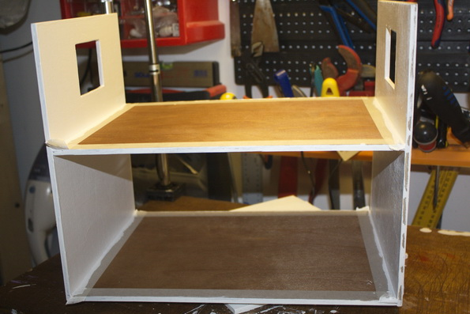

### Η κατασκευή της πόρτας
Για την πόρτα θα χρειαστούμε ένα ορθογώνιο ελάχιστα μικρότερο απο την τρύπα στον τοίχο, 9,8cm(ύψος)x4,8cm(πλάτος),για να μπορεί να ανοίγει με τον συναγερμό τοποθετημένο. Βάφουμε την πόρτα με χρώμα της αρεσκείας μας και σε ύψος 5cm
βιδώνουμε μία μικρή βίδα για χερούλι (να μην βγεί απο την άλλη μεριά). Έπειτα με κοντές βίδες βιδώνουμε τπυς μεντεσέδες στην πόρτα και μετά στον τοίχο.

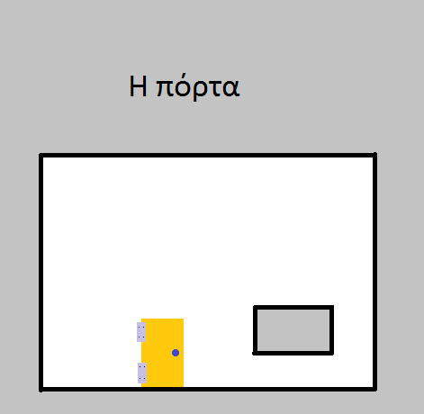

### Η αυλή
Την αυλή την στήνουμε πάνω σε ένα κομμάτι μακετόχαρτο (Εικ.1). Η κατασκευή των φραχτών και της πόρτας γίνεται όπως υποδεικνύει το σκίτσο (Εικ.2+Εικ.3) και με διαστάσεις 11cm, 15cm και 7cm (Εικ.4). Έπειτα κολλάμε τους φράχτες (όχι την πόρτα) στο μακετόχαρτο με κόλλα σιλικόνης (εφόσον θέλετε να διακοσμήσετε τον κήπο κολλήστε και ζωγραφίστε το δάπεδό του πρίν την τοποθέτηση των φραχτών).

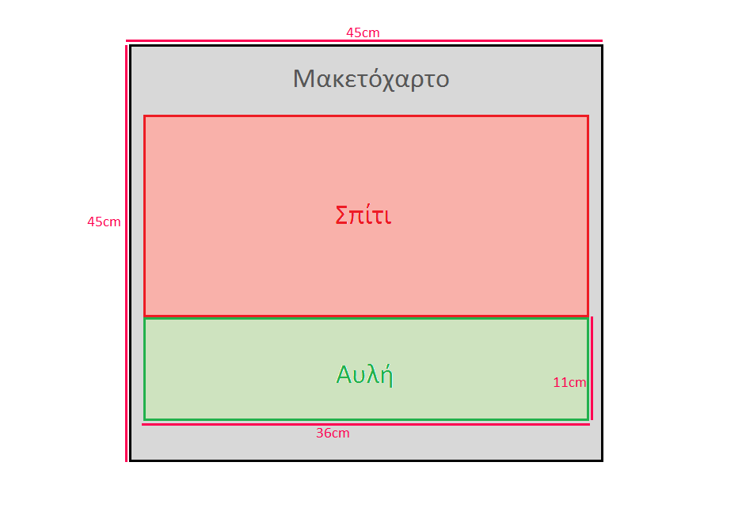    
Εικ 1

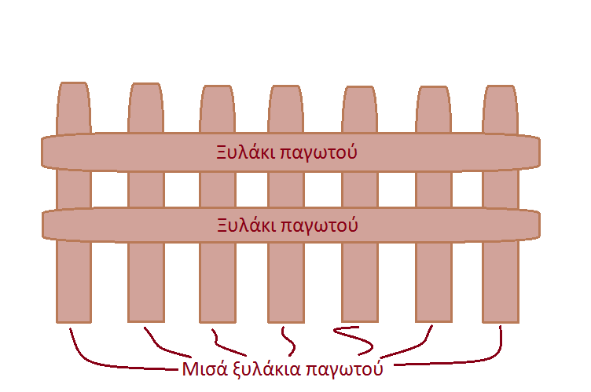     
Εικ 2

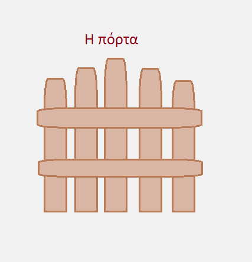   
Εικ 3

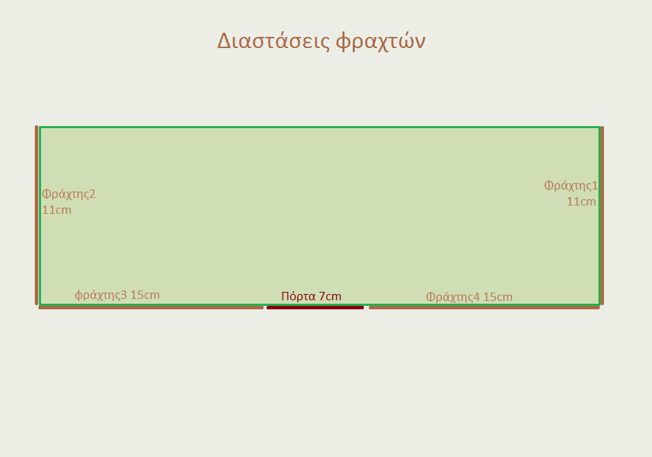
Εικ 4

### Η τέντα
Η τέντα αποτελείται απο τον σκελετό, τρία ξυλάκια για σουβλάκι (τα δύο 9cm και το μεσαίο 11cm) κολλημένα σε σχήμα Π με σιλικόνη, και το πανί (11cm x 11cm) του οποίου η μία άκρη είναι κολλημένη στο πάνω μέρος του παραθύρου και η απένατι άκρη στο μεσαίο ξυλάκι του σκελετού. Τα ξυλάκια στηρίζονται στον τοίχο απο δύο κλειστά γατζάκια που κλείνουν γύρω απο δύο μικρούς δακτυλίους που θα βιδώσουμε (ο ένας 1cm αριστερότερα απο το παράθυρο και ο άλλος 1cm δεξιότερα, και οι δύο σε ευθεία με την βάση του παραθύρου) ωστε να μπορεί να ανοιγοκλείνει.

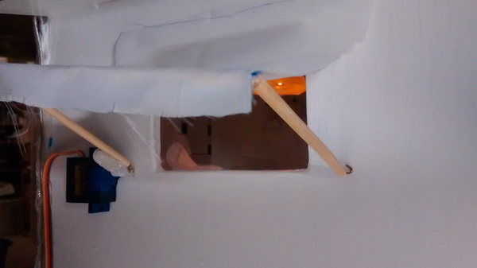

### Καλωδίωση και τοποθέτηση εξαρτημάτων
Τώρα η μακέτα είναι έτοιμη να καλωδιωθεί:

#### Φώτα
Τα φώτα είναι 4 και τοποθετούνται 2 σε κάθε όροφο. Για τα πάνω φώτα βρίσκουμε την μέση του ταβανιού των δύο δωματίων.
Εκεί θα είναι οι άκρες των καλωδίων. αρχίζοντας απο εκεί κολλάμε τις άκρες τους με σιλικόνη κάθετα και συνεχίζουμε να κολλάμε
το καλώδιο ακολουθόντας κατεύθυνση προς το Arduino (D3-D4, GND).
#### Συναγερμός
Ο  συναγερμός θα τοποθετηθεί στην πόρτα όπως υποδεικνύει το σκίτσο με τα καλώδια να κατευθύνονται προς το Arduino (D9, GND).

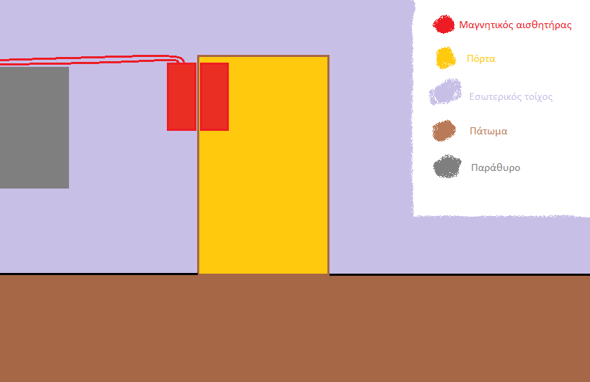

#### Κινητήρας τέντας
O κινητήρας της τέντας θα κολληθεί πλάγια στην αριστερή πλευρά του παραθύρου με τον βραχείωνα κολλημένο στο αριστερό ξυλάκι του σκελετού της. Τα καλώδια ακολουθούν κατεύθυνση προς το Arduino (D12, GND).

#### Διακόπτης φωτών

#### Διακόπτης λειτουργίας

#### Φωτοβολταικά

#### Καλοριφέρ

#### Αισθητήρας θερμοκρασίας

#### Αισθητήρας φωτός

[Αρχική Σελίδα έργου](https://github.com/legeonaf/robotics.ellak)
