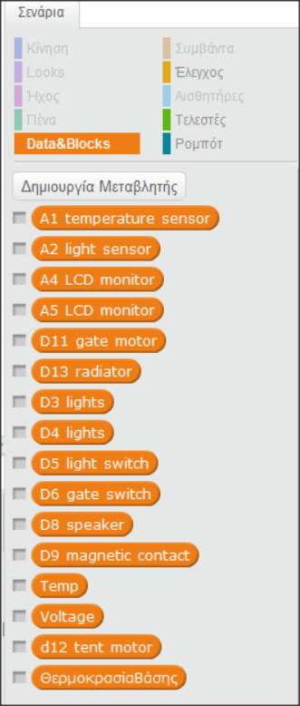
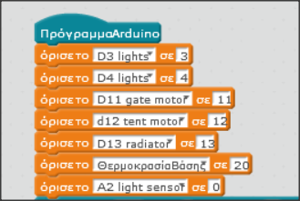
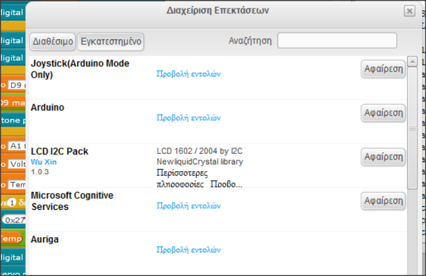
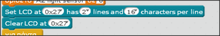
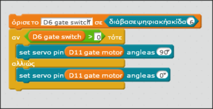
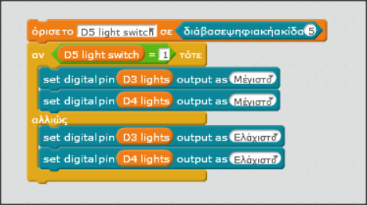
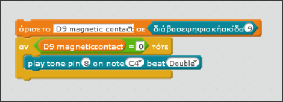
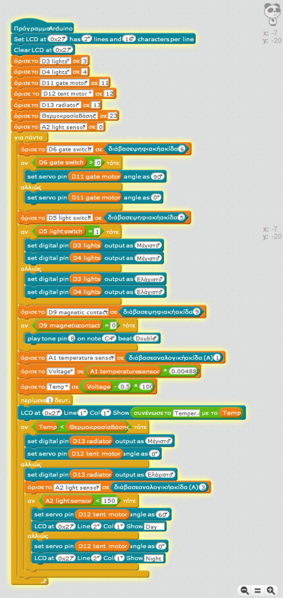

# Ο προγραμματισμός

## Ψηφιακά Pins του Arduino που χρησιμοποιήθηκαν
A/A | Εξάρτημα | Digital Pin
------| ------------|-----------
1 | Φώτα ορόφου  | D3
2 | Φώτα εισογείου  |  D4
3 | Διακόπτης φώτων  |  D5
4 | Διακόπτης Μάντρας  |  D6
5 | Ηχείο  |  D8
6 | Μαγνητική Επαφή Πόρτας |  D9
7 | Servo κινητήρας Μάντρας  |  D11
8 | Servo κινητήρας Τέντας  |  D12
9 | Led Θέρμανσης  |  D13

## Αναλογικά Pins που χρησιμοποιήθηκαν

A/A | Εξάρτημα | Analog Pin
------| ------------|-----------
1 | Αισθητήρας θερμοκρασίας LM 35 | Α1
2 | Αισθητήρας Φωτός | Α2
3 | Οθόνη LCD 16x2  |  A4 - A5

## Λειτουργίες του έξυπνου σπιτιού
Οι λειτουργίες που προγραμματιστηκαν  είναι οι εξής:
- Άνοιγμα/κλείσιμο των εσωτερικών φώτων του σπιτιού
- Άνοιγμα/κλείσιμο της τέντας αυτόματα ανιχνεύοντας το φώς που χτυπάει το σπίτι και βάσει της θερμοκρασίας του σπιτιού
- Άνοιγμα/κλείσιμο της αυλόπορτας με το πάτημα ενός κουμπιού
- Άνοιγμα/κλείσιμο του καλοριφέρ του σπιτιού βάσει της θερμοκρασίας του
- Προβολή στην οθόνη της θερμοκρασίας του σπιτιού και του φωτός που το χτυπάει
- Ενεργοποίηση συναγερμού με το άνοιγμα της πόρτας

## Ο προγραμματισμός και ο κώδικας
Ο προγραμματισμός της μακέτας έγινε με το mBlock, σε περιβάλλον scratch.

###  Δημιουργία μεταβλητών
Το πρώτο βήμα στον προγραμματισμό είναι η δημιουργία των μεταβλητών που θα χρησιμοποιήσουμε.

Γράφουμε το pin στο οποίο συνδέεται το εξάρτημα του οποίου την μεταβλητή δημιουργούμε και το όνομα του εξαρτήματος (το όνομα της μεταβλητής δεν έχει σημασία αρκεί να μπορούμε να ξεχωρήσουμε σε ποιό εξάρτημα αντιστοιχεί). Αφού φτιάξουμε τις μεταβλητές για όλα τα pins μετά φτιάχνουμε τις βοηθητικές, *ΘερμοκρασίαΒάσης*, *Temp*, *Voltage*, οι οποίες δεν αντιστοιχούν σε κάποιο pin και απλά παίρνουν μια τιμή για να βοηθήσουν στον κώδικα.

### Ορισμός μεταβλητών
Τώρα αφού έχουμε δημιουργήσει τις μεταβλητές είναι η ώρα να τους δώσουμε μία τιμή ή να τις ορίσουμε σε ένα pin.

### Η οθόνη LCD
Για να δουλέψει η οθόνη με το πρόγραμμα Mblock θα πρέπει αρχικά να εγκαταστήσουμε από το μενού Επεκτάσεις --> Διαχείριση Επεκτάσεων
την επέκταση LCD I2C Pack

Οι εντολές που αφορούν την οθόνη στην αρχή του προγράμματος είναι οι παρακάτω:

- Η εντολή Set LCD ορίζει τις ιδιότητες της οθόνη που θα χρησιμοποιήσουμε και
- η Clear LCD καθαρίζει την οθόνη.

### Ο διακόπτης της πόρτας
Το πρώτο κομμάτι του κώδικα είναι ο προγραμματισμός του διακόπτη που ανοίγει την αυλόπορτα.

Ορίζουμε την μεταβλητή του διακόπτη να διαβάσει το digital pin 6. Άν ο διακόπτης είναι κλειστός και παιρνάει ρεύμα, άρα είναι Χ>0, τότε ο κινητήρας θα κινηθεί 90 μοίρες αλλιώς θα παραμείνει στις 0.

### Διακόπτης φώτων
Για τον προγραμματισμό του διακόπτη των φώτων θα χρησιμοποιήσουμε την ίδια λογική με τον προηγούμενο διακόπτη μόνο που τώρα θα στείλουμε ή θα κόψουμε το ρεύμα σε δύο pins ταυτόχρονα.

### Μαγνητική επαφή
Για την μαγνητική επαφή ορίζουμε την μεταβλητή της να διαβάσει το pin 9 για input και άμα δεν περνάει ρεύμα, δηλαδή είναι Χ=0, τότε βάζουμε το pin 8, το buzzer, να παίξει ένα τόνο που μοιάζει με συναγερμό.

### Τέντα, και αισθητήρας θερμοκρασίας
Η τέντα και ο αισθητήρας θερμοκρασίας σχετίζονται μεταξύ τους. Πρώτα εξετάζεται η θερμοκρασία και αν αυτή είναι κάτω από 23 βαθμούς τότε η τέντα παραμένει κλειστή προκειμένου ο ήλιος να ζεστάνει γρηγορότερα το σπίτι και επιπρόσθετα ανάβει το καλοριφέρ. Οταν η θερμοκρασία ξεπεράσει τους 23 βαθμούς τότε εξετάζουμε τον αισθητήρα φωτός και ανοίγει την τέντα εφόσον είναι μέρα.

### Το ολοκληρωμένο πρόγραμμα

[Αρχική Σελίδα έργου](https://github.com/legeonaf/robotics.ellak)
